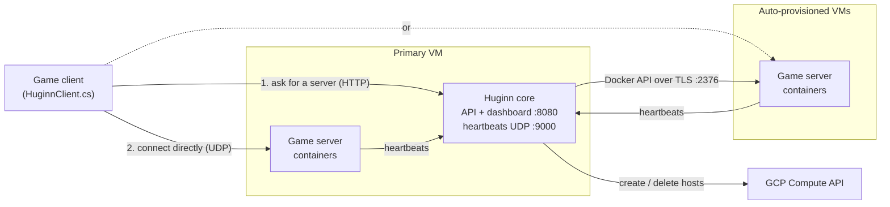

# Huginn

**A lightweight game server fleet manager for indie and small studios — "Agones without Kubernetes."**

Huginn runs your dedicated game servers as Docker containers, tracks their health and player counts through heartbeats, and scales them up and down automatically. When a machine fills up, it provisions a new one on Google Cloud; when a machine sits idle, it removes it. One Go binary, one YAML file, no Kubernetes cluster.

> Huginn currently supports **Google Cloud Platform** only.

---

## Why

Small studios shipping a multiplayer game usually end up choosing between two bad options:

- **Manual management** — SSH into a VPS, start servers by hand. Doesn't scale, easy to break.
- **Heavyweight platforms** — Agones needs a Kubernetes cluster to run and maintain; GameLift and PlayFab lock you into one vendor's hosted service.

Huginn sits in between: Docker-based, self-hosted on your own cloud project, and small enough to understand end to end.

---

## Features

**Fleet management**
- Config-driven: describe your fleet in YAML, or let `huginn init` generate it
- Every game server instance is a Docker container
- Instance-level auto-scaling within your `min_instances` / `max_instances` and buffer settings
- Unhealthy instances (missed heartbeats) are detected and replaced
- Join codes and quick-join for clients

**Multi-host & cloud scaling (GCP)**
- Manages multiple machines at once, placing instances across hosts round-robin
- **Scale-up:** when every host is over the CPU/memory threshold, Huginn creates a new VM, installs Docker, sets up TLS, pulls your image, and adds it to the pool — fully unattended
- **Scale-down:** hosts idle (zero instances) for a configurable time are drained and deleted
- **Self-healing:** hosts deleted outside Huginn are detected and removed, whether mid-provisioning or already running
- **Startup reconciliation:** after a crash or restart, Huginn re-adopts running containers and flags leftover VMs
- Firewall rules kept in sync with the ports actually in use
- The primary host is never scaled down; host auto-scaling is **off by default** so configuring GCP never causes surprise billing

**Dashboard**
- Token-authenticated web UI on port `8080`
- **Fleet:** live instances, player counts, addresses, join codes, live log streaming, player-history chart, restart/stop
- **Hosts:** per-host CPU and memory gauges and instance counts, with drill-down into that host's instances
- **Config:** most settings apply live, without a restart

**Setup automation**
- `install.sh` checks prerequisites, builds, and launches setup
- `huginn init` generates your config and auth token, and can optionally:
  - enable the required GCP APIs, grant IAM roles, and register an SSH key for provisioning
  - generate and install a systemd service so Huginn survives crashes and reboots

Every automated step asks first, shows what it will change, and is safe to re-run.

---

## How it works



1. Game servers send heartbeats (player count, health) to Huginn.
2. A client asks Huginn's API for an available server and gets back a real `ip:port`.
3. The client connects **directly** to that server — Huginn is never in the game traffic path (the same allocation pattern Agones uses).

---

## Quickstart

**Before you start**
- A GCP project with billing enabled
- A GCE VM to run Huginn, created with the **`cloud-platform` access scope**, with Docker, Go, and the gcloud CLI installed
- Your game server, integrated with the Huginn SDK, built as a Docker image and pushed to **Artifact Registry** in `us-central1`
- `gcloud auth login` as a project **owner** (needed only for the automated IAM setup)

**Install**
```bash
git clone <this-repo>
cd hugin
./install.sh
```

`install.sh` builds Huginn and runs `huginn init`. Answer the prompts; saying yes to the automated GCP setup and the systemd install means Huginn is running when `init` finishes.

**Open the dashboard** at `http://<vm-public-ip>:8080` and log in with the `auth_token` from `config.yaml`.

**Connect your game** — ship a `huginn.json` next to your client executable:
```json
{
  "huginnBaseUrl": "http://<vm-public-ip>:8080",
  "huginnToken": "<auth_token from config.yaml>"
}
```

➡️ **Full walkthrough, including manual alternatives for every automated step: [GET_STARTED.md](GET_STARTED.md)**

---

## Example config

```yaml
game: my-fps-game
image: us-central1-docker.pkg.dev/my-project/my-repo/my-server:latest
min_instances: 2
max_instances: 10
buffer_size: 3
max_players: 16
port: 7778
gcp_project: my-project
gcp_zone: us-central1-a
host_auto_scaling_enabled: false       # opt in from the dashboard when ready
host_scale_up_threshold_percent: 90
host_scale_down_idle_minutes: 10
auth_token: <generated by huginn init>
```

---

## Known limitations

- **You build and push your own Docker image** — Huginn does not package game builds.
- **`max_instances` is fleet-wide**, not per host.
- **New hosts can only pull from `us-central1` Artifact Registry.**
- **Huginn itself is a single point of failure.** Running game sessions keep going if it stops, but no new allocations or scaling happen until it's back. Acceptable at the target scale.
- **One auth token** is shared by the dashboard and game clients.
- **GCP only** — AWS and bare-metal are not supported.

## Out of scope

Kubernetes support, matchmaking, and billing/cost tooling.

---

## Status

Actively developed as a final-year Software Engineering project. Core fleet management, multi-host support, automatic host scaling in both directions, self-healing, authentication, and setup automation are implemented and tested live on GCP.
